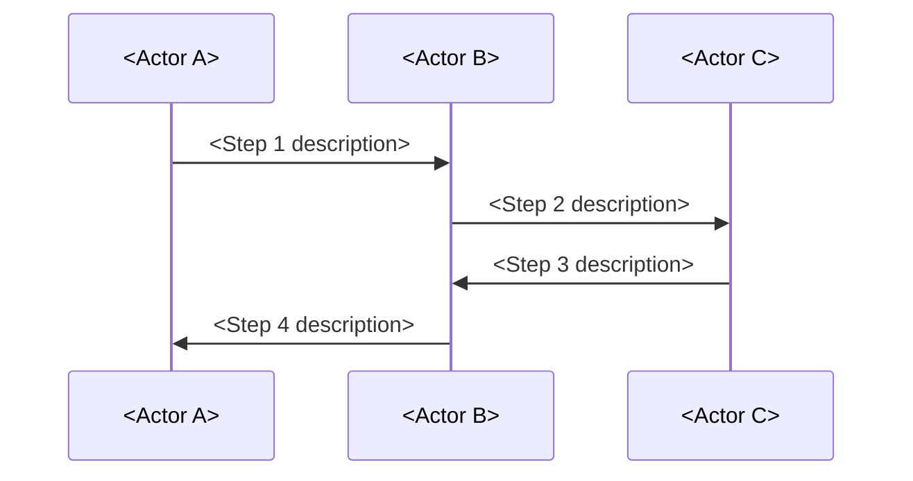
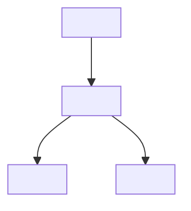
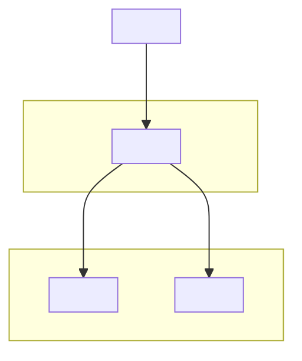

# File Templates

This file contains the complete templates for every file type in the Obsidian vault. Use these templates exactly as written — only adapt the content to the topic, not the structure.

---

## Hub Note Template

Use this for overview files that serve as navigation maps. Hub notes never contain deep explanations — they link to detail notes.

```markdown
---
title: "<Subtopic> Overview"
tags: [<topic-tag>, <tool-tag>, <other-tags>]
difficulty: beginner
related:
  - <Detail-Note-1>
  - <Detail-Note-2>
  - <Detail-Note-3>
  - <Related-Hub-Note>
---

## Concept

<Subtopic> is a <category> that <one-line-description>.

**What problem it solves:** Before <subtopic>, <describe-the-pain>. <Subtopic> introduces <key-innovation> to solve this.

**Key insight:** <One sentence that captures the essential insight a reader must internalize.>

## Core Components

<Subtopic> involves these key areas. See each linked file for deep coverage:

| Component | Purpose | File |
|-----------|---------|------|
| **<Component A>** | <What it does> | [[<Detail-A>]] |
| **<Component B>** | <What it does> | [[<Detail-B>]] |
| **<Component C>** | <What it does> | [[<Detail-C>]] |

## How It Relates to Other Concepts

- Relationship to <Concept X>: <one sentence>. See [[<Concept-X-Overview>]].
- Relationship to <Concept Y>: <one sentence>. See [[<Concept-Y-Overview>]].

## <Primary Tool> Mapping

In <primary tool>, <subtopic> concepts map as follows:

| <Subtopic> Concept | <Tool> Concept |
|-------------------|----------------|
| <Concept A> | <Tool mapping> |
| <Concept B> | <Tool mapping> |

## Navigation

**Prerequisites**
- [[<Foundation-Concept-1>]]
- [[<Foundation-Concept-2>]]

**Related Concepts**
- [[<Related-Hub-1>]]
- [[<Related-Hub-2>]]

**Used In**
- [[<Integration-File-1>]]
- [[<Case-Study-Phase>]]
```

---

## Detail Note Template

Use this for every concept that gets its own file. This is the standard template for all `02-*` through `0N-*` folders.

```markdown
---
title: "<Concept Title>"
tags: [<topic-tag>, <tool-tag>, <other-tags>]
difficulty: beginner | intermediate | advanced
related:
  - <Related-File-1>
  - <Related-File-2>
  - <Related-File-3>
---

## Concept

**<Concept>** is <definition in one sentence>.

**Why <concept> exists:** <The problem that existed before this concept was invented. What was the pain? What naive approach failed?>

**Key insight:** <One sentence that captures the essential mental model.>

### Key Details

<Expand on the concept. Use subsections, tables, or lists. Include:
- Technical specifics that matter in production
- How it differs from similar or commonly-confused concepts
- The non-obvious implications>

## <Fictional Company> Scenario

**Business Requirement:** <What the company needs at this point in their growth. Be specific. Name the stakeholders.>

**Naive Approach (And Why It Fails):**

<Describe the simple, obvious solution a junior engineer would build. Then explain exactly how and why it fails. Be concrete — what breaks? Under what conditions? What is the blast radius?>

**The Solution:**

<Describe what the company implements instead. How does the concept solve the specific failure mode of the naive approach? Include:
- The key design decision
- How it maps to the concept being taught
- A concrete example with realistic values>



## <Primary Tool> Implementation

### Configuration

<Show specific configuration. Use the actual config format — YAML, JSON, HCL, SQL, CLI commands, or UI navigation paths. Do not use pseudocode.>

```
<Real configuration block>
```

### Key Settings

| Setting | What It Does | Recommendation |
|---------|-------------|---------------|
| **<setting-1>** | <Purpose> | <Recommended value and why> |
| **<setting-2>** | <Purpose> | <Recommended value and why> |

### Verification

<How to verify the configuration works. Include a specific command or test.>

## Technical Details

<The deeper technical content. Protocol behavior, internal mechanics, data formats, algorithm descriptions.>

Use Mermaid diagrams for:
- Sequence diagrams showing request/response flows
- Architecture diagrams showing component relationships
- Flow charts for decision logic



Include real examples:
- Request/response samples (JSON, XML, SQL)
- Decoded data structures
- Terminal output showing expected behavior

## Security Considerations (or Risk Considerations)

<For security topics, use "Security Considerations." For reliability or operations topics, use "Risk Considerations." Adapt to the domain.>

| Risk | Description | Severity | Mitigation |
|------|------------|----------|-----------|
| **<Risk 1>** | <What the attacker/failure does> | High/Medium/Low | <How to prevent or detect> |
| **<Risk 2>** | <What the attacker/failure does> | High/Medium/Low | <How to prevent or detect> |

### Real-World Incident

**<CVE ID or Incident Name>** — <Year>

<What happened. What was the impact (dollar amount, users affected, downtime). What was the root cause. How it was fixed.>

**How <Concept> Would Have Helped:** <Connect the incident back to the concept being taught.>

## Debugging & Troubleshooting

### Symptom: "<What the user or operator sees>"

**Diagnostic steps:**
1. <Step 1 — a specific command to run or log to check>
2. <Step 2 — what to look for in the output>
3. <Step 3 — common root causes for this symptom>

**Fix:** <What to change and where.>

## Best Practices

- <Practice 1 with a one-line justification>
- <Practice 2 with a one-line justification>
- <Practice 3 with a one-line justification>
- <Practice 4 with a one-line justification>
- <Practice 5 with a one-line justification>

## Navigation

**Prerequisites**
- [[<must-know-before-this>]]
- [[<must-know-before-this>]]

**Related Concepts**
- [[<same-level-concept>]]
- [[<same-level-concept>]]

**Used In**
- [[<downstream-file-that-depends-on-this>]]
- [[<case-study-phase>]]
```

---

## Case Study Phase Template

Use this for each phase of the fictional company's evolution.

```markdown
---
title: "<Company Name> — Phase <N>: <Title>"
tags: [<topic-tag>, <tool-tag>, case-study]
difficulty: beginner | intermediate | advanced
related:
  - <Phase-N-1>
  - <Phase-N+1>
  - <Concept-Applied-1>
  - <Concept-Applied-2>
---

## Business Context

<Describe the company at this phase. Number of employees, products, customers, revenue stage. What does their technical stack look like? What is their current architecture? Reference the previous phase.>

## The Challenge

<What new business requirement or constraint appears? Why now? Who is asking for it (customer, CTO, compliance, growth)? Be specific.>

## Naive Approach (And Why It Fails)

**The obvious solution:** <What a reasonable but inexperienced engineer would propose.>

**Why it fails:** <Specific failure mode. Under what conditions does it break? What is the impact on the business? Include concrete numbers if possible (e.g., "At 10,000 users, the database can't keep up — query latency goes from 50ms to 5 seconds").>

## The Solution

**What they implement:** <Describe the architecture change or new component.>

**Implementation details:** <Specific configuration, code patterns, or infrastructure changes. Reference the primary tool.>



## Key Decisions

| Decision | Alternatives Considered | Why This Choice |
|----------|------------------------|-----------------|
| **<Decision 1>** | <Alt A>, <Alt B> | <Reasoning> |
| **<Decision 2>** | <Alt A>, <Alt B> | <Reasoning> |

## What Changes

<What is different compared to the previous phase? What was added, removed, or changed? What stayed the same?>

## Concepts Applied

- [[<Concept-1>]] — <How it is used in this phase>
- [[<Concept-2>]] — <How it is used in this phase>
- [[<Concept-3>]] — <How it is used in this phase>

## Troubleshooting

**Common issues during this phase:**
- <Issue 1> — <Symptom + fix>
- <Issue 2> — <Symptom + fix>

## Navigation

**Previous Phase:** [[<Phase-N-1>]]
**Next Phase:** [[<Phase-N+1>]]
**Related Concepts:** [[<Concept-1>]], [[<Concept-2>]]
```

---

## Meta File Templates

### Glossary Entry Format

```markdown
## <Letter>

**<Term>**
<Definition in 1-3 sentences. Include a [[wiki-link]] to the relevant detail note.>
```

### Cheat Sheet Format

```markdown
## <Category> Cheat Sheet

### <Subcategory>

| Column | Column | Column |
|--------|--------|--------|
| **<Value>** | <Value> | <Value> |

### Critical Checklist

- [ ] <Check 1>
- [ ] <Check 2>
```

### Learning Path Format

```markdown
## Level <N>: <Title> (Week <X-Y>)

<One sentence describing what this level covers.>

### Read in this order:
1. [[<File-1>]] — <One-line description>
2. [[<File-2>]] — <One-line description>

### Hands-on:
- <Exercise 1>
- <Exercise 2>

### Checkpoint:
<Questions the reader should be able to answer after this level.>
```

### Interview Prep Format

```markdown
**Q: <Question>?**

<Answer in 3-5 sentences. Demonstrate understanding, not memorization. Include a [[wiki-link]] for deeper reading.>
```

### Troubleshooting Guide Format

```markdown
### Symptom: "<What the user sees>"

**Diagnostic path:**
1. <Step 1>
2. <Step 2>

**Fix:** <What to change.>
```

### Architecture Patterns Format

```markdown
## Pattern <N>: <Name>

**Problem:** <What situation calls for this pattern?>

**Solution:** <The architecture. Include a Mermaid diagram.>

**When to use:** <Specific conditions.>

**Related:** [[<Concept>]], [[<Concept>]]
```

---

## Frontmatter Rules

Every file must have valid YAML frontmatter between `---` markers:

```yaml
---
title: "<Human-Readable Title>"
tags: [<topic-tag>, <tool-tag>, <domain-tag>, <additional-tags>]
difficulty: beginner | intermediate | advanced
related:
  - <Related-File-1>
  - <Related-File-2>
---
```

Notes:
- `title` uses human-readable format with spaces and capitalization
- `tags` uses lowercase, hyphenated if multi-word
- `difficulty` is one of: `beginner`, `intermediate`, `advanced`
- `related` lists filenames without `.md` extension or `[[ ]]` brackets
- The filename itself must be kebab-case (e.g., `my-concept-name.md`) because Obsidian wiki links use filenames
